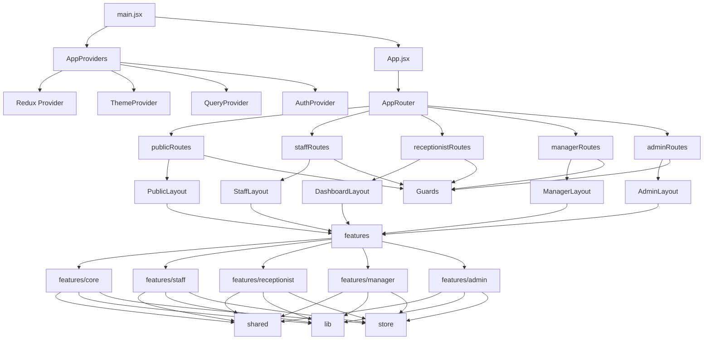

# Nailify FE Web

Frontend web cho hệ thống Nailify, phục vụ 4 nhóm người dùng chính:

- `staff`
- `receptionist`
- `manager`
- `admin`

Stack hiện tại:

- `React 19`
- `Vite`
- `React Router`
- `Redux Toolkit`
- `TanStack Query`
- `Tailwind CSS`
- `Axios`
- `Ant Design`

## Chạy dự án

```bash
npm install
npm run dev
```

Build production:

```bash
npm run build
```

Lint:

```bash
npm run lint
```

## Package Diagram

Sơ đồ dưới đây mô tả package-level architecture hiện tại của FE:



## Relationships

Quan hệ package theo diagram nên hiểu như sau:

```text
src
├── app
│   ├── layouts
│   ├── providers
│   └── router
├── features
│   ├── admin
│   ├── core
│   ├── manager
│   ├── receptionist
│   └── staff
├── lib
├── store
├── styles
└── shared
    ├── components
    │   ├── common
    │   ├── guards
    │   └── ui
    ├── assets
    │   ├── fonts
    │   ├── icons
    │   └── images
    ├── constants
    ├── guards
    ├── hooks
    └── utils
```

Luồng phụ thuộc chính:

```text
src/app -> src/features
src/app -> src/shared
src/app -> src/store

src/features/admin -> src/shared, src/lib, src/store
src/features/core -> src/shared, src/lib, src/store
src/features/manager -> src/shared, src/lib, src/store
src/features/receptionist -> src/shared, src/lib, src/store
src/features/staff -> src/shared, src/lib, src/store

src/shared/components -> src/shared/constants, src/shared/hooks, src/shared/utils
src/shared/guards -> src/features/core/auth, src/shared/constants, src/shared/utils
```

Ràng buộc nên giữ:

- `app` chỉ điều phối `router`, `layouts`, `providers`; không chứa business logic nghiệp vụ.
- `features` là tầng nghiệp vụ chính, được phép dùng `shared`, `lib`, `store`.
- `shared` là tầng tái sử dụng chung; nên tránh để `shared` phụ thuộc ngược vào feature khác, trừ các guard/auth helper nếu dự án đang dùng tạm.
- `lib` là adapter cho thư viện ngoài như `axios`, `query client`, date helpers.
- `store` là state dùng xuyên feature; không nên nhét logic UI cục bộ vào đây.
- `styles` là package độc lập cho global styling, không nên chứa logic nghiệp vụ.

## ASCII package flow

### 1. Người dùng đi vào hệ thống

```text
[User]
   |
   +--> [Public Routes] --> [Login Page]
   |
   +--> [Staff Routes] --> [Staff Layout] --> [Staff Features]
   |
   +--> [Receptionist Routes] --> [Dashboard Layout] --> [Receptionist Features]
   |
   +--> [Manager Routes] --> [Manager Layout] --> [Manager Features]
   |
   +--> [Admin Routes] --> [Admin Layout] --> [Admin Features]
```

### 2. Luồng xử lý chính của frontend

```text
[main.jsx]
   |
   +--> [AppProviders]
   |       |
   |       +--> [Redux Provider]
   |       +--> [ThemeProvider]
   |       +--> [QueryProvider]
   |       +--> [AuthProvider]
   |
   +--> [App.jsx]
           |
           +--> [AppRouter]
                   |
                   +--> [publicRoutes]
                   +--> [staffRoutes]
                   +--> [receptionistRoutes]
                   +--> [managerRoutes]
                   +--> [adminRoutes]
```

### 3. Layer/package dependency

```text
[Users]
   |
   v
[Route Guards]
   |
   v
[Layouts]
   |
   v
[Feature Pages]
   |
   +--> [Feature Components]
   |
   +--> [Feature Hooks]
   |
   +--> [Feature Services] ---> [lib/axiosClient]
   |                                 |
   |                                 +--> [Backend API]
   |
   +--> [shared/*]
   |
   +--> [store/*]
```

### 4. Phụ thuộc ở mức package

```text
[app]
   |
   +--> [router]
   +--> [layouts]
   +--> [providers]
           |
           +--> [store]
           +--> [shared]

[features/core]
   |
   +--> [shared]
   +--> [lib]
   +--> [store]

[features/staff]
   |
   +--> [shared]
   +--> [lib]
   +--> [store]
   +--> [features/core/booking-management]

[features/receptionist]
   |
   +--> [shared]
   +--> [lib]
   +--> [store]
   +--> [features/core/dashboard]

[features/manager]
   |
   +--> [shared]
   +--> [lib]
   +--> [store]

[features/admin]
   |
   +--> [shared]
   +--> [lib]
   +--> [store]
```

### 5. Data flow thực tế trong project

```text
[Page]
   |
   +--> [Hook] ------------------+
   |                             |
   +--> [Dispatch Redux Action]  |
   |                             v
   +------------------------> [Service]
                                 |
                                 +--> [Mock Data]
                                 |
                                 +--> [Axios Client] --> [API]
```

## Cấu trúc package

### 1. `src/app`

Tầng bootstrap ứng dụng:

- `providers/`: bọc toàn app bằng Redux, theme, query, auth
- `router/`: khai báo route theo role
- `layouts/`: layout riêng cho public, staff, receptionist, manager, admin

Luồng vào app:

`main.jsx` -> `AppProviders` -> `App.jsx` -> `AppRouter`

### 2. `src/features`

Tầng nghiệp vụ chính, tổ chức theo domain và role.

Các package chính đang có:

- `features/core/auth`: đăng nhập, auth hook, auth service
- `features/core/dashboard`: dashboard theo role
- `features/core/booking-management`: booking dùng chung nhiều role
- `features/staff/bookings`: luồng staff xử lý design studio và service session
- `features/receptionist/bookings`: booking phía lễ tân
- `features/receptionist/payment`: checkout/thanh toán phía lễ tân
- `features/manager/bookings`: booking phía manager
- `features/manager/staff-artist-management`: quản lý staff/artist
- `features/manager/customer-nail`: quản lý mẫu móng của khách
- `features/admin/*`: các module quản trị hệ thống như users, salons, staff, nail designs, categories, procedures, components, nail shapes, nail surfaces, pricing

Mỗi feature đang đi theo pattern tương đối ổn định:

```text
feature/
├── pages/
├── components/
├── services/
├── hooks/
├── utils/
└── constants/
```

Lưu ý: không phải feature nào cũng có đủ toàn bộ thư mục trên. Một số module hiện chỉ dùng `pages/` và `services/`.

### 3. `src/shared`

Tầng dùng chung cho toàn app:

- `components/ui`: UI primitives và reusable widgets
- `components/common`: navbar, sidebar, pagination, loading, empty state
- `components/guards`: `AuthGuard`, `RoleGuard`, `GuestGuard`
- `constants`: route constants, role constants, app config, API endpoint constants
- `hooks`: hook generic
- `utils`: formatter, validator, storage, error handler
- `assets`: ảnh dùng chung

Đây là package nền mà hầu hết feature đều phụ thuộc.

### 4. `src/lib`

Tầng adapter cho thư viện ngoài:

- `axiosClient.js`: cấu hình axios, `baseURL`, request interceptor
- `queryClient.js`: cấu hình TanStack Query client
- `dayjs.js`: cấu hình date handling
- `tailwindHelper.js`: helper cho class Tailwind

Nguyên tắc: feature nên gọi API qua `services/`, còn `services/` dùng lại `lib/axiosClient.js`.

### 5. `src/store`

Global state bằng Redux Toolkit:

- `authSlice`
- `bookingSlice`
- `layoutSlice`
- `nailDesignSlice`
- `serviceSessionSlice`
- `index.js`: cấu hình store và subscribe lưu local storage

Store hiện được dùng cho các state cần chia sẻ xuyên màn hình hoặc cần persistence cục bộ.

## Sơ đồ phụ thuộc

Thứ tự phụ thuộc nên hiểu như sau:

```text
app -> features -> shared
app -> store
features -> lib
features -> shared
features -> store
shared -> lib   (chỉ khi thật sự cần)
```

Nên tránh chiều ngược lại:

- `shared` không nên phụ thuộc vào `features`
- feature A không nên import trực tiếp page/component nội bộ của feature B nếu chưa có abstraction rõ ràng
- route chỉ nên trỏ vào `pages`, không chứa business logic

## Mapping package theo role

### Public

- `app/router/publicRoutes.jsx`
- `app/layouts/PublicLayout.jsx`
- `features/core/auth/*`

### Staff

- `app/router/staffRoutes.jsx`
- `app/layouts/StaffLayout.jsx`
- `features/core/dashboard/pages/StaffDashboardPage.jsx`
- `features/core/booking-management/*`
- `features/staff/bookings/*`

### Receptionist

- `app/router/receptionistRoutes.jsx`
- `app/layouts/DashboardLayout.jsx`
- `features/core/dashboard/pages/ReceptionistDashboardPage.jsx`
- `features/receptionist/bookings/*`
- `features/receptionist/payment/*`

### Manager

- `app/router/managerRoutes.jsx`
- `app/layouts/ManagerLayout.jsx`
- `features/core/dashboard/pages/ManagerDashboardPage.jsx`
- `features/manager/bookings/*`
- `features/manager/staff-artist-management/*`
- `features/manager/customer-nail/*`

### Admin

- `app/router/adminRoutes.jsx`
- `app/layouts/AdminLayout.jsx`
- `features/core/dashboard/pages/AdminDashboardPage.jsx`
- `features/admin/*`

## Cấu trúc thư mục rút gọn

```text
src/
├── app/
│   ├── layouts/
│   ├── providers/
│   └── router/
├── features/
│   ├── admin/
│   ├── core/
│   ├── manager/
│   ├── receptionist/
│   └── staff/
├── lib/
├── shared/
├── store/
├── styles/
├── App.jsx
└── main.jsx
```

## Ghi chú hiện trạng

- Dự án đang kết hợp cả `Redux Toolkit` và `TanStack Query`.
- Một số service đã gọi API thật, ví dụ auth qua `axiosClient`.
- Một số module vẫn đang dùng mock data/service, đặc biệt ở các luồng booking và management.
- Có dấu hiệu dự án đang chuyển dần sang feature-based architecture, nhưng vẫn còn vài phần legacy song song trong cấu trúc.

## Đề xuất quy ước khi mở rộng

- Thêm màn hình mới: đặt ở `features/<role-or-domain>/<feature>/pages`
- Thêm API call: đặt ở `services/` của feature
- Thêm reusable UI: đặt ở `shared/components/ui`
- Thêm helper dùng chung: đặt ở `shared/utils`
- Thêm route mới: khai báo trong `shared/constants/routes.js` trước, sau đó gắn vào file route tương ứng trong `src/app/router`
- Chỉ đưa vào `store/` khi state cần dùng liên feature hoặc cần giữ qua refresh

## File quan trọng để đọc trước

- `src/main.jsx`
- `src/App.jsx`
- `src/app/providers/AppProviders.jsx`
- `src/app/router/AppRouter.jsx`
- `src/shared/constants/routes.js`
- `src/store/index.js`
